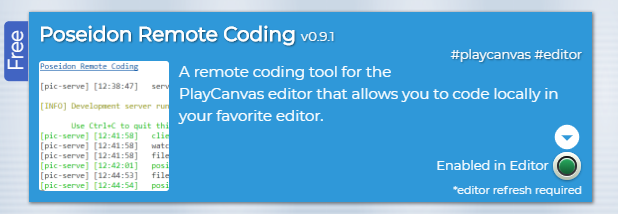

# Poseidon Remote Coding

A remote coding tool for PlayCanvas that allows you to code locally in your favorite editor and have your code uploaded to your PlayCanvas project.

## Installation

1. Make sure you have Node (8+) and NPM installed and install the following extension globally:

```shell
npm install poseidon-remote-coding --global
```

2. Install the [PIC Chrome extension](https://chrome.google.com/webstore/detail/playingincanvas/dfokedhgmlgbgmkhfhcingaieajhibhb).

3. Register on the [Playing In Canvas](https://pic.pirron-rodon.one) store and grab for free the **Poseidon Remote Coding** extension.

## Usage

1. Run the following command from inside your local script folder:

```
pic-serve
```

Note: The first time you run this command you will be prompted to allow the generation of a local SSL certificate to your computer. This is mandatory to accept since the PlayCanvas Editor is running on a secure domain, otherwise the extension will fail to work.

2. Open your PlayCanvas project in Chrome and make sure that the Poseidon Remote Coding extension is enabled in the PIC Chrome extension.



That's it a new folder will be created in your PlayCanvas project called **remote-scripts** which will automatically sync with your local folder on each file update.

Note: The pipe works only from local to remote and not the other way around.

## How it works?

1. The pic-serve command is executing a NodeJS script that sets up a file watcher for any .js file.

2. As soon as a change has been detected (file added or updated) it communicates on port 23001 using WebSockets with the PIC Chrome extension.

3. The extension receives the update and adds/updates the respected asset script in the PlayCanvas editor.

Note: If you open multiple PlayCanvas projects then the last one will be the one connected to the pic-serve instance.


## Supported Assets

The following asset files are supported and will be automatically synchronized based on their filename extension:

- .js (script)
- .json (json)
- .glsl (shader)
- .html (html)
- .css (css)
- .txt (text)

## Options

- You can use the -s flag when running pic-serve to enable system beep sounds on success events (Windows only).

## Roadmap

- Allow multiple pic-serve instances running on different ports to allow multiple PlayCanvas projects listening at the same time.

- Add a customization panel for the extension to allow changing the behaviour of each running instance (port, folder name etc.).
